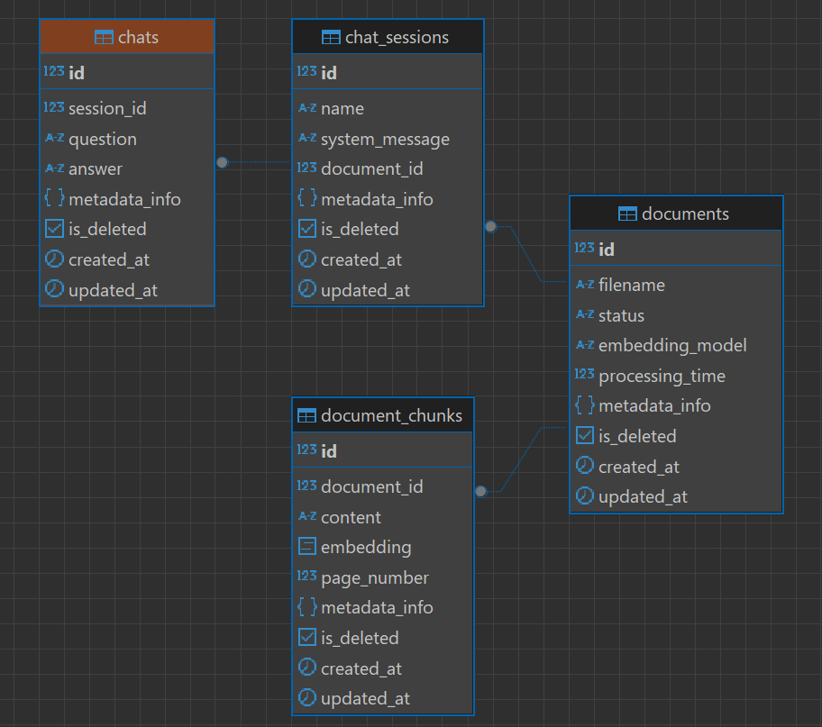

## Document-QA

An application featuring backend services and Question-Context-Answer (QCA) capabilities, powered by a Retrieval-Augmented Generation (RAG) system. The application is designed to manage users, handle documents, and run an ingestion pipeline that generates embeddings for efficient document retrieval.

## Tech Stack


## Table of Contents

- [Run Locally](#run-locally)
- [Run Locally with Dockerfile](#run-locally-with-dockerfile)
- [Features](#features)
- [Current Architecture Diagram](#current-architecture-diagram)
- [Automated CI/CD](#automated-cicd)
- [API Endpoints](#api-endpoints)
- [ER Diagram](#er-diagram)
- [UML Diagrams](#uml-diagrams)
    - [ORM Classes](#orm-classes)
    - [CRUD Classes](#crud-classes)
    - [Controller Classes](#controller-classes)
- [Testing](#testing)
- [Architecture Diagram for Scale](#architecture-diagram-for-scale)
- [Limitations](#limitations)
- [Planned Enhancements](#planned-enhancements)

## Run locally

```sh
git clone https://github.com/aps08/document-qa.git
cd document-qa
pip install -r requirements.txt
# set environmental variables in .env file
python app/main.py
# swagger docs at: http://localhost:8000/docs
```

## Run locally with Dockerfile

```sh
git clone https://github.com/aps08/document-qa.git
cd document-qa
docker build . -t aps08/document-qa:latest
# set environmental variables in .env file
docker run -p 8000:8000 --env-file .env --name document-qa-container aps08/document-qa:latest
```

## Features

- Embed documents for processing.  
- Retrieve document details with pagination support.  
- Create a session using a selected document.  
- Chat with the document through the created session.  
- Users can choose from the following models for chatting:
  - `gpt-3.5-turbo`
  - `gpt-3.5-turbo-0125`
  - `gpt-4`
  - `gpt-4-turbo`
  - `gpt-4-1106-preview`
  - `gpt-4-0125-preview`
- While creating a session, users can customize:
  - The system message  
  - The session name  
  - The `max_tokens` value
- Provides the page number information is retrieved from.


## Current Architecture Diagram


Using `text-embedding-3-small`. Cheaper and faster than `text-embedding-3-large`.

## Automated CI/CD

This GitHub Actions workflow automates the CI/CD pipeline for building, publishing, and deploying a Docker image of the application. It consists of two jobs: publish and deploy.

Trigger:
- The workflow is triggered manually using workflow_dispatch.
- It can also be triggered on push to the main branch or changes to specific files.

Jobs:
- `publish` - Runs on github runner. Builds the docker image and pushes it to Docker Hub.
- `deploy` - Runs on self hosted runner (In my case AWS EC2). Deploys the docker container to the target environment. This job only runs if `publish` is successful.

## API Endpoints


## ER Diagram



Table details:
- `documents` - Store overall document related information and metadata related to same. Metadata like size, pages can be used for a metrics to charge users.
- `document_chunks` - Store Chunk content and vector and metadata like usage which can be used for metrics to charge users. Content is stored so that user can remove chunks not needed for seaching and for audit purpose.
- `chat_sessions` -  Session which document information user has selected. System_message which user can customize.
- `chats` - all the records of the conversation along with the answer and usage information is stored here.

## UML Diagrams

### ORM Classes


### CRUD Classes


### Controller Classes


## Testing

The application includes a comprehensive test suite to ensure the reliability and correctness of its features. The tests are written using pytest and cover various aspects of the application, including API endpoints, database operations, and business logic. All the tests are given [here](./tests/)

Follow the commands to run the test cases

```sh
# runs all test cases
pytest

# get coverage report
pytest --cov=app
```

Test coverage at current point of time:


## Architecture Diagram for scale


## Limitations

- Only PDF files are supported.  
- Each session can be created with a single document only.  
- Images and tables within the documents are currently not processed.

You can find some sample PDF files [here](./docs/pdf/).

## Planned Enhancements

- Offload large file ingestion using a queue system and notify users upon completion.  
- Store files in S3 to allow for reprocessing in case of failures.
- Client side file upload on ingestion request.
- Implement batch embedding using OpenAI in chunks of 500-800 token.  
- Add support for embedding images and tables.  
- Enable support for additional file formats.
- Utilize UUIDs to ensure compatibility in distributed systems.  
- Implement caching for recently accessed or frequently used files.
- Usage metrics for user.
- Let users decide the embedding model.